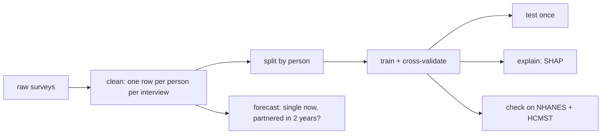

# girlfriend-predictor

**Try it:** [girlfriend-predictor.vercel.app](https://girlfriend-predictor.vercel.app). Answer a few questions and see how often people like you lived with a partner.

Predicts the chance that an adult has a partner (married or living together) from facts about
them: age, sex, education, work, earnings, height, personality, family background. Despite the
name it covers men and women and any live-in partner. It is trained on a US survey that followed
the same ~9,000 people, born 1980-84, from 1997 to 2023.

**How well it works:** on 1,770 people it never saw, it ranks a partnered and a single person
correctly 79% of the time (ROC-AUC 0.790), against 72% for age and sex alone. Its percentages are
calibrated: when it says 60%, about 60% of those people are partnered.

**The findings in plain language:** [results/insights.md](results/insights.md).

## What it found

- **Age matters most**, and the rise flattens around 30: +22 pp for men and +19 pp for women from 22 to 32.
- **For men, work is the strongest factor they control:** no work → full-time at $40k goes with +22 to +24 pp at every age. For women after 25 it goes slightly the other way.
- **Earnings matter about three times more for men** ($20k → $60k: +11 pp men, +3.5 pp women), but partly because a partner raises earnings: among singles, earnings predict finding a partner much less (6 pp vs 15 pp).
- **College delays partnering rather than preventing it:** graduates are behind in their 20s and ahead by 35-43.
- **Height matters little; personality somewhat more:** height 170 → 185 cm goes with +1.2 pp for men; being outgoing, organised or calm goes with +3 to +5 pp each.

All are associations, not causes; each finding in the write-up says which way it probably runs.

## Data

Three free public surveys, no scraping. Population surveys instead of dating-site profiles
because a dating site's "not single" users aren't typical (many are in open relationships).

- **NLSY97** (main training data): 8,851 people, 131,644 yearly interviews at ages 18+.
- **NHANES** and **HCMST 2017**: other Americans, used only to check that the findings hold.

Raw data is not in this repo; each survey keeps its own terms of use.

## How it was built

- **Target:** `partnered = 1` if married or living with a partner at the interview.
- **No leakage:** the model never sees facts that give the answer away, such as household
  income (two earners), household size, spouse variables or children living at home.
  Facts that change over time only carry forward, never backward.
- **Split by person, not by row:** each person has up to 21 interviews. 20% of people, with all
  their rows, are locked away as the test set; cross-validation is also grouped by person.
  Otherwise the model would recognise people instead of learning patterns.
- **Models compared** (5-fold cross-validation on the training people; lower log loss is better):

  | model | log loss | ROC-AUC |
  |---|---|---|
  | age + sex baseline | 0.607 | 0.711 |
  | logistic regression | 0.570 | 0.764 |
  | CatBoost (gradient-boosted trees) | 0.546 | 0.789 |
  | TabPFN (pretrained tabular model) | 0.554 | 0.781 |

  Stacking the models tied with CatBoost alone, so the final model is CatBoost plus a
  calibration step (Platt scaling). Test set: log loss 0.543, ROC-AUC 0.790.
- **Explanations:** SHAP values show how much each fact pushes one person's prediction up or down.
  Each finding is re-checked on 5 models retrained on different 80% slices and kept only if
  all 5 agree on the direction.
- **Forecast model:** among people single today, who has a partner about 2 years later?
  Every input comes from before the outcome, so it gets closer to cause. It is much harder
  (ROC-AUC 0.635) and is tested on the latest interviews only.
- **Outside check:** a model with the 7 facts all surveys share, trained on NLSY97 and scored
  unchanged on NHANES (ROC-AUC 0.712) and HCMST (0.748). Age, the job effect for men, the
  education pattern and the race gap hold in all three.

## Run it

    python3 -m venv .venv && .venv/bin/pip install -r requirements.txt
    make data    # downloads NHANES and HCMST; NLSY97 is manual, see below
    make all     # clean → split → train → evaluate → explain → forecast → outside check (~30 min)
    make test

NLSY97 can't be scripted: in the free [NLS Investigator](https://www.nlsinfo.org/investigator),
select the NLSY97 1997-2023 variables that `src/clean_nlsy97.py` reads, download the extract as CSV
and unzip it into `data/raw/nlsy97/`.

Predict one person (every field except `age` may be left out):

    echo '{"age": 29, "sex": "male", "education": "bachelor_plus", "earnings": 55000}' | .venv/bin/python src/predict.py

## Web page

`web/` is a one-page site on Vercel: a short form, the person's number, and what the model
leaned on. Its one function, `web/api/predict.js`, passes the answers to a SageMaker Serverless
endpoint (`sagemaker/`: a small HTTP server around the same model). It signs in to AWS through
Vercel's OIDC, so no AWS keys are stored. Nothing anyone types is stored or logged.

- **Skipped answers get typical values** for the person's sex and age (`sagemaker/typical.py`).
  CatBoost reads a blank number as "below everyone". On the test set, skipping height alone
  lowered the number by 5.5 points on average; leaving blank what the form never asks put the
  average at 69% against a true 59%, and typical values put it at 57%.
- **"What the model leaned on"** is CatBoost's SHAP values for the answers given, in words.
  The calibration step is linear in log-odds, so they add up exactly to the number shown.

Deploy (AWS CDK in Python, `infra/app.py`, eu-west-1):

    python3 -m venv infra/.venv && infra/.venv/bin/pip install -r infra/requirements.txt
    BUDGET_EMAIL=you@example.com make bootstrap # once per account and region
    BUDGET_EMAIL=you@example.com make deploy    # image, endpoint, roles, $10 budget alert

The page deploys on every push to `main`: the Vercel project builds from `web/` and needs
`AWS_ROLE_ARN`, `AWS_REGION` and `SAGEMAKER_ENDPOINT` set. To run it locally, start the image on port 8080 (`sagemaker/Dockerfile`) and `vercel dev` in `web/`.

## Limits

- One US generation (born 1980-84), ages 18-43. The results may not hold for other generations or countries.
- "Partnered" means living together. In HCMST, 46% of people this target calls single have a partner they don't live with.
- Associations, not causes. The forecast model narrows this, it doesn't remove it.
- Survey weights are not used yet, so groups the survey oversampled (Black and Hispanic respondents) weigh more.

## Where things are

- `src/`: one plain script per step, in the order of `make all`; `predict.py` scores one person.
- `results/`:
  - [`insights.md`](results/insights.md): what goes with having a partner, for everyone.
  - [`metrics.md`](results/metrics.md) and [`cv_results.md`](results/cv_results.md): test and cross-validation scores.
  - [`forecast.md`](results/forecast.md): finding a partner within 2 years.
  - [`outside_check.md`](results/outside_check.md): do the findings hold in other surveys?
  - [`explain_numbers.md`](results/explain_numbers.md): every number behind the insights.
- `sagemaker/`, `infra/`, `web/`: the model server, its AWS setup, and the web page.
- `tests/`: pytest checks for prediction, the web form's model code, the forecast rows and the outside check.
- `notebooks/explore.ipynb`: first look at the data.
