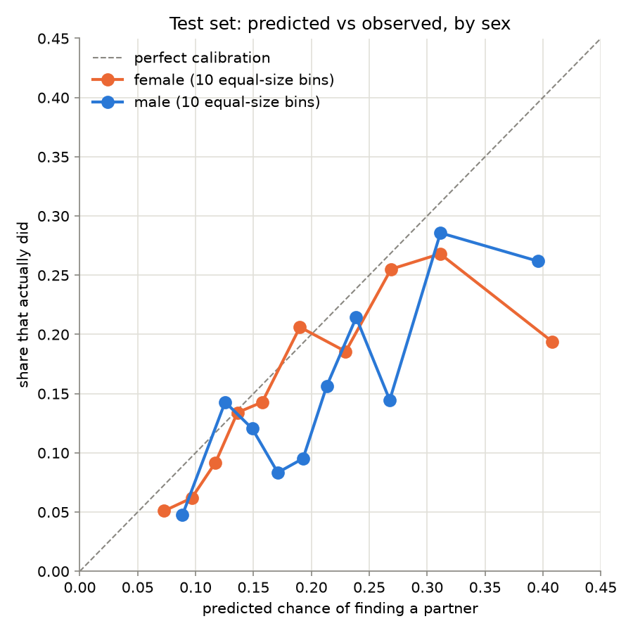
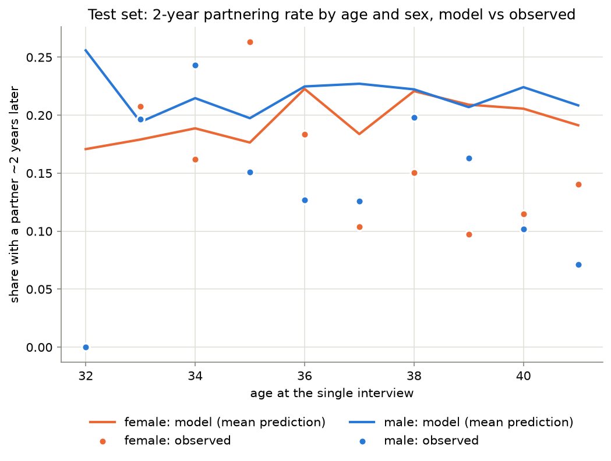
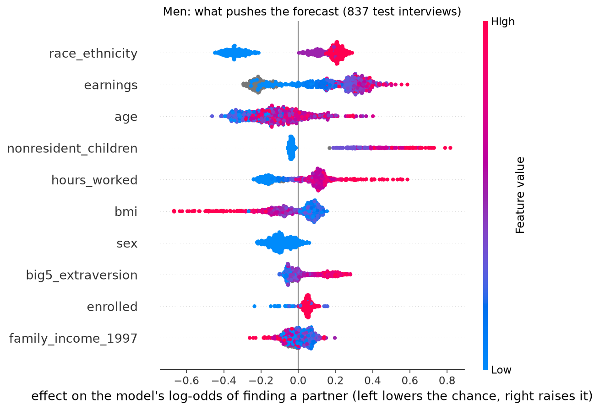
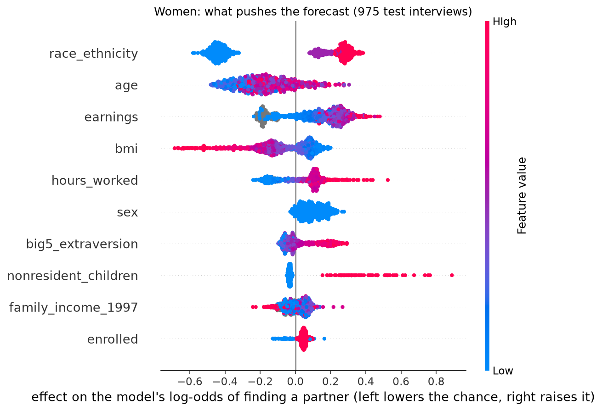

# Finding a partner within about two years

Among NLSY97 adults who were **single** at an interview - not married, not living with a
partner - **15.7% had a partner (married or living together) at the
interview closest to 2 years later**. This page builds a model that predicts that from facts
known **before**: age, education, work, earnings, height, personality, family background.
Because every input is older than the outcome, a partner's own income or housing cannot
masquerade as "earnings help" - the classic reason "partnered right now" numbers overstate
what a person can change.

## The rows

64,872 rows, 8,209 people, single at ages 18-41,
interviews 1998-2022. Each row needs a follow-up interview
2-3 years later (51,331 rows matched at 2 years, 13,541 at 3); single interviews without one
were dropped. Across all rows, 20.4% found a partner.

## Train and test: earlier interviews vs the latest ones

- **Train:** rounds 1-17 (interviews
  1998-2016), 41,156 rows,
  5,707 people, 21.2% found a partner.
- **Test:** rounds 18-20 (interviews
  2017-2022), 1,812 rows,
  870 people, 15.7% found a partner.
- **Set aside, unused:** 7,958 earlier-round rows belonging to the test people.

Two rules, and why. **Time:** every test interview happened after every training interview,
so the test imitates the real use: applying the model to a future it has not seen. **People
separate:** keeping a person's earlier rows in train while their latest row is in test would
let the model partly "recognise" the person instead of learning what singles are like.

The order of those two rules matters, and the first attempt got it wrong. Removing "the test
people's earlier rows" from train sounds natural - but the test people **are** the long-term
singles, and deleting exactly them left train with the singles who partnered in the end:
68% of that train's 35+ singles found a partner within 2 years, against the true
17%. Every model trained on such a set overpredicts wildly on the
test years. Holding people out **at random** instead (the other 70% of people
to train, the rest never seen) keeps train representative while both rules still hold.

What the split costs, honestly: the NLSY97 cohort was born 1980-84, so the test interviews
only contain ages 32-41 - behavior for singles in their
20s is measured only by cross-validation on earlier data - and the training rounds contain
no single person older than 36 (238 training
rows are 35+), while 54% of test rows are older. There, every model is
extrapolating past anything it has seen. And partnering rates fell over the decades, so the
calibrator is fitted on out-of-fold predictions from rounds 12+ only
(11,761 rows, interviews 2010 onward), the era closest to the test years; it puts
weight 0.85 on CatBoost's log-odds. The calibration plot shows how well
that worked.

## Model comparison (cross-validation on train)

Mean ± sd over 5 folds grouped by person. Lower is better except ROC-AUC.

| model | log_loss | brier | roc_auc | calib_error |
|---|---|---|---|---|
| age_sex_baseline | 0.5119 ± 0.0098 | 0.1656 ± 0.0041 | 0.5628 ± 0.0127 | 0.0163 ± 0.0046 |
| logistic | 0.4961 ± 0.0123 | 0.1603 ± 0.0048 | 0.6426 ± 0.0145 | 0.0160 ± 0.0033 |
| catboost | 0.4908 ± 0.0117 | 0.1588 ± 0.0046 | 0.6578 ± 0.0124 | 0.0163 ± 0.0020 |

## Test: the latest interviews (2017-2022)

| group | rows | found a partner | log_loss | brier | roc_auc | calib_error |
|---|---|---|---|---|---|---|
| age + sex baseline | 1812 | 0.157 | 0.4473 | 0.1363 | 0.4532 | 0.0674 |
| logistic | 1812 | 0.157 | 0.4254 | 0.1304 | 0.6277 | 0.0323 |
| catboost (raw) | 1812 | 0.157 | 0.4359 | 0.1358 | 0.6350 | 0.0581 |
| catboost + calibration (final) | 1812 | 0.157 | 0.4303 | 0.1330 | 0.6350 | 0.0492 |

The age + sex floor scores below chance on AUC (0.4532) for the extrapolation reason
above: at the ages it never saw it predicts the same average for everyone, which ranks the
37+ test rows too high. Logistic regression, which bends a curve through age instead of
memorising cells, is the honest "guess by age and sex" here; CatBoost adds a little on top.

By sex and by age band (final model):

| group | rows | found a partner | log_loss | brier | roc_auc | calib_error |
|---|---|---|---|---|---|---|
| female | 975 | 0.159 | 0.4309 | 0.1339 | 0.6397 | 0.0431 |
| male | 837 | 0.155 | 0.4296 | 0.1319 | 0.6340 | 0.0636 |

| group | rows | found a partner | log_loss | brier | roc_auc | calib_error |
|---|---|---|---|---|---|---|
| 30-34 | 287 | 0.199 | 0.4681 | 0.1507 | 0.6787 | 0.0382 |
| 35-41 | 1525 | 0.150 | 0.4232 | 0.1296 | 0.6279 | 0.0599 |

For scale: the same recipe predicting "partnered now" scores 0.790 AUC on
its own held-out test set, versus 0.6350 here - the 2-year question is
genuinely harder, as expected for something with a lot of chance in it.

## What goes with finding a partner (SHAP)

Each row is one feature: its average push on the model (log-odds) for men and for women
separately, and the value groups with the strongest down and up push, in plain percentage
points (pp) around the test's average of 16%. Pushes are relative
to the training-era average of 21%; the test years run lower, so
lines can sit below zero overall. Red dots in the figures are high feature values, blue are
low.

| feature | men: avg push | women: avg push | values with the strongest down vs up push (shift in the chance) |
|---|---|---|---|
| race_ethnicity | 0.24 | 0.34 | black -4.6 pp ... other +3.6 pp |
| earnings | 0.24 | 0.18 | low +0.6 pp ... high +4.4 pp |
| age | 0.16 | 0.20 | 30-34 -3.4 pp ... 35-41 -1.6 pp |
| bmi | 0.11 | 0.15 | high -2.9 pp ... low +1.2 pp |
| hours_worked | 0.13 | 0.12 | low -1.5 pp ... high +2.1 pp |
| nonresident_children | 0.15 | 0.06 | 0 -0.5 pp ... any other value +6.1 pp |
| sex | 0.09 | 0.10 | male -1.2 pp ... female +1.3 pp |
| big5_extraversion | 0.07 | 0.08 | low -0.6 pp ... high +2.3 pp |
| family_income_1997 | 0.05 | 0.05 | high -0.0 pp ... middle +0.8 pp |
| enrolled | 0.05 | 0.05 | college_2yr -0.9 pp ... not_enrolled +0.7 pp |

## "Partnered now" vs "finds a partner": which features may run backwards

The "now" columns refit the partnered-now recipe on its own train set and explain it the same
way; shares are each feature's slice of total importance, so the two questions can be
compared. A feature big for "now" but small for "finding" mostly marks *having* a partner,
not *getting* one - often the partner is the cause (two incomes, shared housing). These are
associations, not proven causes.

| feature | 'partnered now' share | its low vs high values, now | 'finds a partner' share | its low vs high values, finding | read |
|---|---|---|---|---|---|
| age | 19% | 18-24 -13.1 pp ... 35-41 +14.3 pp | 10% | 30-34 -3.4 pp ... 35-41 -1.6 pp | matters for both questions |
| race_ethnicity | 12% | black -14.1 pp ... other +6.0 pp | 16% | black -4.6 pp ... other +3.6 pp | matters for both questions |
| earnings | 11% | low -7.0 pp ... high +11.9 pp | 11% | low +0.6 pp ... high +4.4 pp | matters for both questions |
| sex | 10% | male -6.2 pp ... female +6.5 pp | 5% | male -1.2 pp ... female +1.3 pp | minor for both |
| enrolled | 9% | high_school -18.1 pp ... not_enrolled +3.6 pp | 3% | college_2yr -0.9 pp ... not_enrolled +0.7 pp | matters for now, much less for finding: likely runs backwards |
| bmi | 4% | low -3.1 pp ... high +2.8 pp | 7% | high -2.9 pp ... low +1.2 pp | minor for both |
| hours_worked | 2% | low -1.6 pp ... high +1.9 pp | 7% | low -1.5 pp ... high +2.1 pp | minor for both |
| nonresident_children | 1% | any other value -4.2 pp ... 0 +0.4 pp | 6% | 0 -0.5 pp ... any other value +6.1 pp | minor for both |
| big5_extraversion | 4% | low -0.0 pp ... high +6.4 pp | 4% | low -0.6 pp ... high +2.3 pp | minor for both |
| big5_conscientiousness | 3% | low -2.6 pp ... high +3.1 pp | 1% | low +0.0 pp ... high +0.6 pp | minor for both |
| family_income_1997 | 2% | high -0.7 pp ... middle +1.0 pp | 3% | high -0.0 pp ... middle +0.8 pp | minor for both |
| mother_educ_grade | 3% | high -2.8 pp ... low +1.4 pp | 2% | high -0.2 pp ... middle +0.5 pp | minor for both |

## The short version

- **Race is the model's biggest single push.** Black singles sit -4.6 pp from the test average, Other singles +3.6 pp; the average push is bigger for women (0.34) than men (0.24).
- **Own earnings help, but modestly.** The low-to-high earnings gap is 4 pp here, against 19 pp in the partnered-now model: money mostly marks *having* a partner more than it drives *getting* one.
- **Children living elsewhere flip sign.** Singles who already have such children (78% of them men) go +6.1 pp on the 2-year forecast, while the partnered-now model puts them 4.2 pp lower. Association, not proof - but the reversal is striking.
- **Enrollment separates now, not next.** Students and non-enrolled people differ by 22 pp in the partnered-now model but only 2 pp here: it shifts *when* people partner, and says almost nothing about who finds someone within two years.
- **Outgoing people do better on both questions.** The low-to-high extraversion gap is 3 pp here and 6 pp for being partnered - one of the few personality reads that survives both questions.

## Limits

Associations, not causes - measuring features before the outcome removes the worst backwards
arrow, not all of them. One US cohort born 1980-84, and the test years cover ages
32-41 only. Unweighted (survey weights not used), and
people who left the survey are absent. The target counts only marriage and living together:
a girlfriend or boyfriend not living together counts as "still single".
