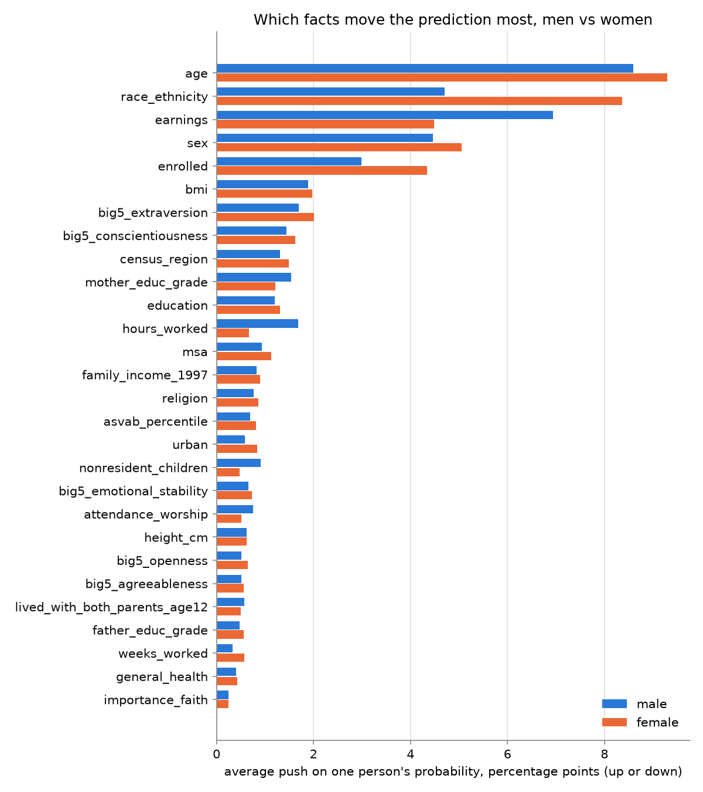
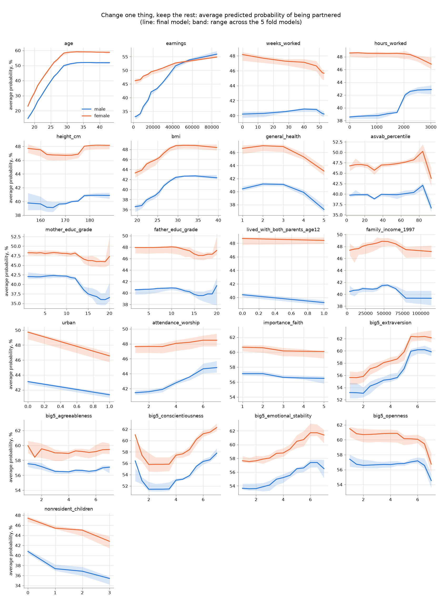
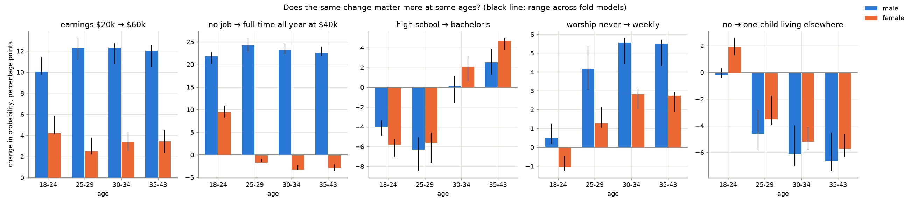
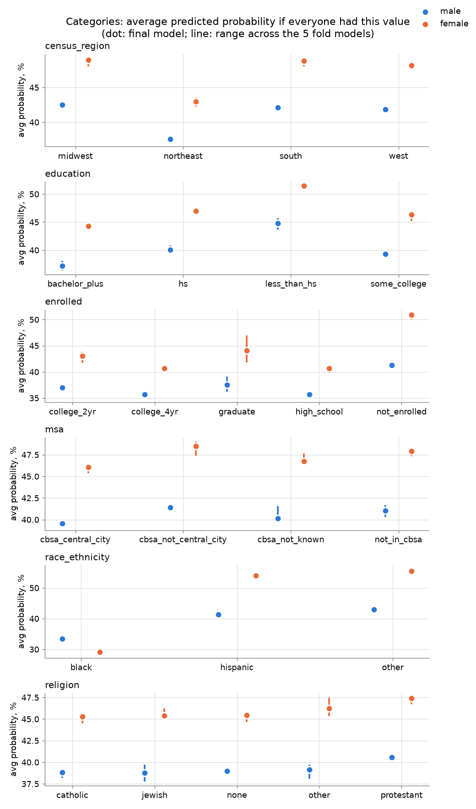

# What goes with having a partner: men and women, ages 18-43

Plain-language findings from the partner-status model. Every number here comes from
`src/explain.py` (full tables in [explain_numbers.md](explain_numbers.md)) or from the test
scores in [metrics.md](metrics.md).

## What this is, in five lines

- **Who:** Americans born 1980-84, interviewed every year from 1997 to 2011 and every two years
  after that, up to 2023 (the NLSY97 survey). The model learned from 7,080 of them; one row per person per interview, ages 18 to 43.
- **"Partnered"** means married or living together. A boyfriend or girlfriend you don't live with
  counts as single here.
- **The model** guesses the chance that a person is partnered from about 28 facts about them. On
  people it never saw it ranks a partnered and a single person correctly 79% of the time
  (age and sex alone: 72%). Useful, far from a crystal ball.
- **Everything below is an association, not a cause.** "Men who earn more are more often
  partnered" does not say that a raise gets you a partner. Some links even run backwards: people
  gain weight after they settle down. Each finding says which way it probably runs.
- **The explanations use the training people only**; the test people stayed locked away.

## How to read the numbers

- **Percentage points (pp).** If a chance goes from 40% to 45%, that is +5 pp.
- **"Change one thing."** Take 2,000 real men (or women) from the data, give all of them the same
  value for one fact (say, earnings of $20k), keep everything else about them, and average the
  model's answers. Then do it again at $60k. The difference is the effect. It answers: *among people
  who are otherwise alike, how different are the chances?*
- **Stable or not.** The model was retrained five times, each time on a different 80% of the
  people. A finding is called **stable** only when all five versions agree on its direction. The
  range in brackets, e.g. (+10 to +12), is what those five versions said. The main model's own
  number can land just outside that range, because it learned from all the people, not 80%.
- **Small and modest.** Below 1 pp a finding is called **small** and not worth acting on.
  Stable findings between 1 and about 2 pp are called **modest**: real, but minor.

## The big picture

*How far each fact moves one person's predicted chance, on average, up or down.*

Age moves the prediction most (about 9 pp per person on average), then race, earnings, sex,
and whether someone is still a student. Everything about looks, personality, religion and
family background moves it by 2 pp or less on average. The top five kept the same rank in all
five retrained versions.

*Each panel: the average chance as one fact changes and everything else stays. Blue men,
orange women; the shaded band is the spread across the five retrained versions.*

## The findings

### 1. Age: the clock matters most, and it flattens around 30
- Going from 22 to 32 with everything else the same: **+22 pp for men, +19 pp for women**
  (stable).
- At 22, women already have a higher chance than men (40% vs 30% on average): women partner a
  few years earlier. Real rates in the data: at 18-24, 30% of women's rows and 19% of men's are
  partnered; at 35-43, both are at about 63%.
- The curve rises steeply until about 29-30 and is flat after that.
- **Direction:** not really cause or effect, it is time. Worth knowing: being single at 25 is
  still the norm for men (just under half partnered at 25-29).

### 2. Having a job: the biggest thing a man can change
- A man going from no work at all to a full-time, all-year job at $40k: **+22 to +24 pp at every
  age** (stable). For a typical 30-year-old man: 55% → 76%.
- For women it depends on age: **+9.5 pp at 18-24**, but **−2 to −3 pp from 25 on** (stable).
  For a typical 30-year-old woman: 82% → 76%.
- Weeks worked alone, with the pay kept the same, barely matters for men (+0.1 pp, small): the job
  shows up through the pay and hours. For women, working all 52 weeks instead of none, pay kept the
  same, goes with **−2.4 pp** (stable), the same backwards pattern as below. Men working about
  2,080 hours a year instead of 1,000: **+3.3 pp** (stable). For women, more hours: no difference
  (−0.1 pp).
- **Direction:** for men, probably both ways. Research agrees that a steady job makes a man more
  likely to marry, and married men also work more. For women after 25 it is **likely backwards**:
  partnered women, especially mothers, more often cut back or stop working.

### 3. Earnings: matters about three times more for men
- $20k → $60k a year: **+11 pp for men, +3.5 pp for women** (both stable).
- The gap holds at every age: men +10 to +12 pp in each age band, women +2.5 to +4 pp.
- For a typical 30-year-old man: 69% → 80%. For a typical 30-year-old woman: 76% → 78%.
- The curve for men rises fastest up to about $45k and then slows.
- **Direction:** both ways, mostly backwards. Earning well helps a man find and keep a partner,
  and married men earn more (the "marriage premium": they work more, and partners support
  careers). The 2-years-later model ([forecast.md](forecast.md)), which only uses facts from
  before, sees a much smaller earnings gap among singles finding a partner (6 pp from low to high
  earnings, against 15 pp for "partnered now" at the same ages): money marks *having* a partner
  more than it drives *getting* one.

### 4. Student years and college: a delay, not a "no"
- Being enrolled in school or college right now, compared with not enrolled: **−4 to −6 pp for
  men, −7 to −10 pp for women** (stable).
- A bachelor's degree instead of high school only: **−4 to −6 pp at ages 18-29**, but
  **+2.5 pp for men and +4.7 pp for women at 35-43** (stable; for men at 30-34 it is 0).
- A mother with 16 years of school instead of 12: **−4.5 pp for men, −2 pp for women** (stable).
- **Direction:** mostly timing. Graduates partner later, then catch up and overtake. Children of
  educated parents also partner later; whether they catch up was not measured. The
  2-years-later model agrees that school shifts *when* people partner more than *whether*: being
  a student separates people by 11 pp for "partnered now" but only 5 pp for finding a partner
  ([forecast.md](forecast.md)). The model only sees people up to 43, so it cannot say how the
  story ends.

*The same change, measured separately in each age band. Black lines: spread across the five
retrained versions.*

### 5. Personality: outgoing, organised and calm go with being partnered
Measured with a 10-question test from 2008 on, so only for people aged about 23 and older.
On a 1-7 scale, going from 3 to 6:
- **Extraversion** (outgoing, energetic): **+5.5 pp men, +4.9 pp women** (stable).
- **Conscientiousness** (organised, dependable): **+4.9 pp men, +5.4 pp women** (stable).
- **Emotional stability** (calm, not easily upset): **+3.3 pp men, +3.7 pp women** (stable).
- Agreeableness and openness: under 1 pp (small).
- **Direction:** unclear, probably partly cause. Personality changes slowly, so it is more
  likely to shape partnering than to be shaped by it, but a good relationship can also make people
  calmer. The test has only two questions per trait, so it is rough.

### 6. Religion: weekly worship goes with partnership, mostly for men over 25
- Attending worship about weekly instead of never: **+4 to +6 pp for men from 25 on**, **+1 to
  +3 pp for women from 25 on** (stable). At 18-24: +0.5 pp men (small), −1.1 pp women.
- For a typical 28-year-old man: 69% → 74%.
- Protestants have a slightly higher chance than every other group: **+1.5 to +2 pp** (stable,
  except "other religion" for women).
- How important faith is to someone: under 1 pp (small). It's the going that counts, not the
  believing.
- **Direction:** both ways. Religious communities encourage marriage and introduce people, and
  couples (especially with children) start going to church again.

### 7. Body: weight is likely backwards; height is modest
- BMI 22 → 32: **+4.8 pp men, +3.8 pp women** (stable). The chance rises until a BMI of about 30
  and is flat after.
- **Direction: likely backwards.** People put on weight after settling down (shared meals, less
  dating, children). This does not mean being heavier helps: among singles, a high BMI goes with a
  slightly *lower* chance of finding a partner within 2 years (−2.0 pp below the average single, [forecast.md](forecast.md)).
- Height for men, 170 → 185 cm: **+1.2 pp** on average (stable, modest); for a typical
  30-year-old man +2.6 pp (71% → 74%). Most of the gain comes between 175 and 180 cm.
- Height for women, 157 → 170 cm: −0.9 pp (small).
- Health from "excellent" to "fair": **−1.3 pp for women** (stable), −0.5 pp for men (small).
  The chance drops faster at "poor".
- **Direction of height:** height can't be caused by a partner, so this is the one body fact
  that could be cause, and it's modest.

### 8. Place: cities and the Northeast have more single people
- Living in an urban area instead of a rural one: **−1.8 pp men, −3.2 pp women** (stable).
- Living in the central city of a metro area instead of its suburbs: **−1.9 pp men, −2.4 pp
  women** (stable).
- Northeast instead of the South: **−4.6 pp men, −5.9 pp women** (stable). Midwest and West are
  about the same as the South.
- **Direction:** unclear, partly backwards. Single people move to city centres and couples move to
  suburbs; the South also has a culture of marrying earlier.

### 9. A child living elsewhere: a sign of a past relationship
- One biological child who lives elsewhere, instead of none: from 25 on, **−4.6 to −6.7 pp for
  men** and **−3.5 to −5.7 pp for women** (stable). At 18-24 it's +1.9 pp for women and nothing
  for men.
- For a typical 30-year-old: men 74% → 67%, women 76% → 70%.
- **Direction: mostly backwards.** A child living with the other parent usually means the
  relationship with that parent ended. It shows who is currently between relationships, not that
  children scare partners off: among singles, those with a child living elsewhere are *more*
  likely to find a partner within 2 years (+6.6 pp above the average single,
  [forecast.md](forecast.md)).

### 10. Race: a large gap that is about marriage markets, not about the person
- Black instead of other races (mostly white, also Asian, Native American and mixed race), with
  everything else the same: **−9.6 pp for men and −26 pp for
  women** (stable). Hispanic: −1.7 pp men, −1.6 pp women.
- This is the second-strongest fact in the model and the one most different between the sexes.
- **Direction:** not something a person causes. Research links it to the local pool of partners
  (among Black Americans there are fewer men than women of the same age with steady jobs, partly
  from incarceration and unemployment), and to people marrying mostly within their own group. This
  data cannot test those explanations.

### Modest, small or unstable findings (don't lean on these)
- Test scores (ASVAB, 25th → 75th percentile): +1.1 pp men, +2.1 pp women (stable, modest).
- Lived with both parents at 12: −1.2 pp for men (stable, modest, surprising), −0.3 pp for women
  (small).
- Father's education 12 → 16 years: −1.1 pp men, −1.3 pp women (stable, modest).
- Family income in 1997, height for women, agreeableness, openness, importance of faith:
  under 1 pp.
- Metro area "not known", and "other religion" for women: the five versions disagree on the
  direction (**unstable**).

## Same person, one thing changed

One made-up "typical" person per row: the most common answer on every question, and the middle
value on every number, among people of that sex and age in the data. Here that is a
non-Black, non-Hispanic Protestant in the South with some college, a full-year job, about 180 cm
(men) or 163 cm (women), and no children living elsewhere. That profile is on the lucky side of
several findings above, so these people start well above the average for their age (at 30-34, 59%
of men and 62% of women are partnered).

| person | change | chance before → after | in points (5 versions) |
|---|---|---|---|
| man, 30 | earnings $20k → $60k | 69% → 80% | +10.9 (+9.9 to +11.8) |
| woman, 30 | earnings $20k → $60k | 76% → 78% | +1.6 (+1.8 to +3.2)¹ |
| man, 30 | no job → full-time at $40k | 55% → 76% | +21.6 (+20.1 to +24.5) |
| woman, 30 | no job → full-time at $40k | 82% → 76% | −5.9 (−6.0 to −4.3) |
| man, 30 | high school → bachelor's | 75% → 74% | −1.2 (−3.6 to −0.2) |
| woman, 30 | high school → bachelor's | 77% → 77% | −0.1 (small) |
| man, 30 | height 170 → 185 cm | 71% → 74% | +2.6 (+1.1 to +3.6) |
| woman, 30 | BMI 22 → 32 | 75% → 77% | +2.0 (+0.8 to +3.8) |
| man, 28 | worship never → weekly | 69% → 74% | +5.4 (+4.0 to +6.7) |
| woman, 28 | worship never → weekly | 74% → 76% | +1.9 (+1.1 to +3.4) |
| man, 30 | no → one child living elsewhere | 74% → 67% | −6.3 (−7.8 to −4.4) |
| woman, 30 | no → one child living elsewhere | 76% → 70% | −6.5 (−6.8 to −4.6) |

¹ The main model's number sits just below the five versions' range; see "How to read the numbers".

Caveats that apply to every row: these are the model's guesses for a person who does not exist,
not a forecast for you. A single typical person can land on a quirk of the model, so the averages
over 2,000 real people in the findings above are the safer numbers. And the BMI, no-job-for-women
and child rows are most likely the partner causing the fact, not the other way round.

## What this means if you're dating

- **Time is on your side until about 30.** Most of the rise happens between 20 and 30. Being
  single at 25 is ordinary; at 25-29 about half of men and just over half of women are partnered.
- **Men: a steady job matters more than anything else you can change.** Going from no work to a
  full-time job goes with about +22 pp at every age; higher pay adds more, and most of the pay
  effect comes before about $45k. For women, earnings and work matter much less.
- **College puts partnering later, not off.** Graduates are behind in their twenties and ahead by
  their late thirties.
- **Being outgoing, organised and even-tempered goes with being partnered**, for both sexes and
  by similar amounts (about +3 to +5 pp each). These are also things people can practise.
- **Community helps.** Weekly worship goes with +4 to +6 pp for men over 25. The likely lesson is
  broader than religion: regular groups where you meet the same people week after week.
- **Looks matter less than the internet says.** Height goes with about +1 pp for men across the
  normal range; weight looks positive but that is marriage changing weight, not weight
  attracting a partner.
- **Where you live changes the numbers you see around you.** City centres and the Northeast have
  more single people your age, which makes being single there more common, not a personal failing.

## What this data can't tell you

- **What causes what.** Every finding here is a link measured at the same moment. A job, a
  partner, weight and church going all influence each other. The 2-years-later model
  ([forecast.md](forecast.md): people single now, who has a partner two years on?) gets closer to
  cause, and is quoted above where it backs a direction.
- **Girlfriends and boyfriends you don't live with.** "Partnered" here means married or living
  together, not "in a relationship". In another survey (HCMST 2017), 46% of the 18-43-year-olds
  this definition calls single had a partner they don't live with: 60% of women, 32% of men
  ([outside_check.md](outside_check.md)).
- **Attraction, dating apps, how people meet, or how happy couples are.** None of that is in the
  data.
- **People born outside 1980-84, older than 43, or outside the US.** Younger generations partner
  later and meet differently.
- **Sexual orientation.** Not separated here.
- **The US population as a whole.** The survey over-samples Black and Hispanic Americans, and the
  numbers here are not weighted to correct for that. Differences between groups (the findings
  above) are less affected than overall rates.
- **You.** A 70% for a group means 3 in 10 people like that are single. The model is right about
  groups far more often than about any one person.

## How these numbers were checked

- Every "change one thing" effect was recomputed with five versions of the model, each trained on
  a different 80% of the people. Findings where the versions disagree on direction are marked
  unstable above; findings under 1 pp are marked small.
- The ranking of facts by importance was recomputed with each version on people it had not
  trained on; the top five kept their rank in all five.
- Charts for every fact, including the categories (region, education, enrolment, city type, race,
  religion), are in `figures/`:
  
