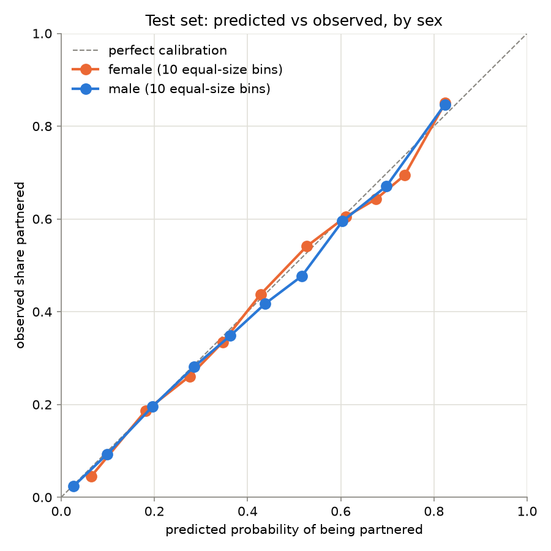
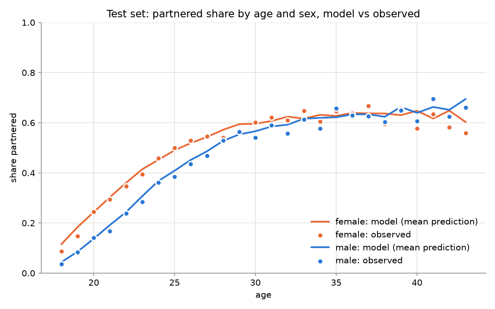

# Test set results

26,434 rows, 1,770 people never seen in training. Unweighted (survey weights not used). Lower is better except ROC-AUC. calib_error: mean gap between predicted and observed rate over 10 equal-size bins.

Second opening of the test set: a re-report after a data fix (hours_worked above 8,760 set to missing), with no changes to the model code or settings.

## All models

| group | rows | partnered | log_loss | brier | roc_auc | calib_error |
|---|---|---|---|---|---|---|
| age + sex baseline | 26434 | 0.428 | 0.6007 | 0.2086 | 0.7178 | 0.0100 |
| catboost | 26434 | 0.428 | 0.5426 | 0.1844 | 0.7896 | 0.0151 |
| final stack | 26434 | 0.428 | 0.5425 | 0.1844 | 0.7896 | 0.0146 |

## Final stack by sex

| group | rows | partnered | log_loss | brier | roc_auc | calib_error |
|---|---|---|---|---|---|---|
| female | 13466 | 0.460 | 0.5600 | 0.1910 | 0.7776 | 0.0184 |
| male | 12968 | 0.395 | 0.5244 | 0.1775 | 0.7981 | 0.0146 |

## Final stack by age band

| group | rows | partnered | log_loss | brier | roc_auc | calib_error |
|---|---|---|---|---|---|---|
| 18-24 | 10989 | 0.233 | 0.4454 | 0.1458 | 0.7856 | 0.0124 |
| 25-29 | 6800 | 0.502 | 0.6354 | 0.2222 | 0.6920 | 0.0208 |
| 30-34 | 3608 | 0.598 | 0.6014 | 0.2074 | 0.7201 | 0.0282 |
| 35-39 | 3554 | 0.639 | 0.5882 | 0.2017 | 0.7161 | 0.0296 |
| 40-43 | 1483 | 0.619 | 0.5840 | 0.1995 | 0.7376 | 0.0490 |

## Confidently wrong

Rows where the final model was sure, split into right and wrong answers.

| confidence | actually | rows | share | mean age | men | median earnings | mean weeks worked | has nonresident children |
|---|---|---|---|---|---|---|---|---|
| predicted ≥ 0.9 | right | 186 | 0.935 | 37.6 | 0.54 | 101,500 | 40.9 | 0.00 |
| predicted ≥ 0.9 | wrong | 13 | 0.065 | 39.5 | 0.46 | 107,500 | 29.9 | 0.00 |
| predicted ≤ 0.1 | right | 3031 | 0.965 | 19.2 | 0.63 | 3,000 | 25.9 | 0.01 |
| predicted ≤ 0.1 | wrong | 110 | 0.035 | 19.7 | 0.66 | 5,000 | 30.5 | 0.03 |

## Figures

