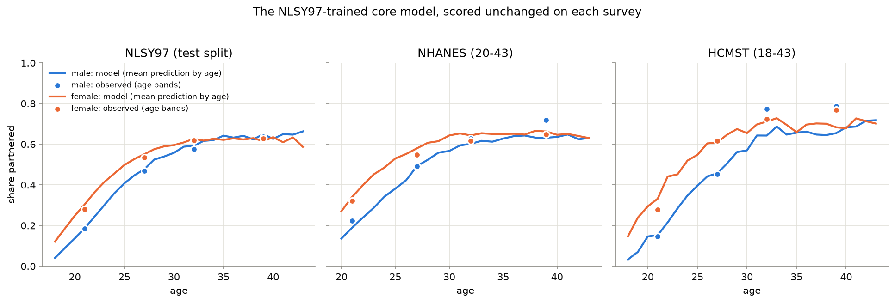
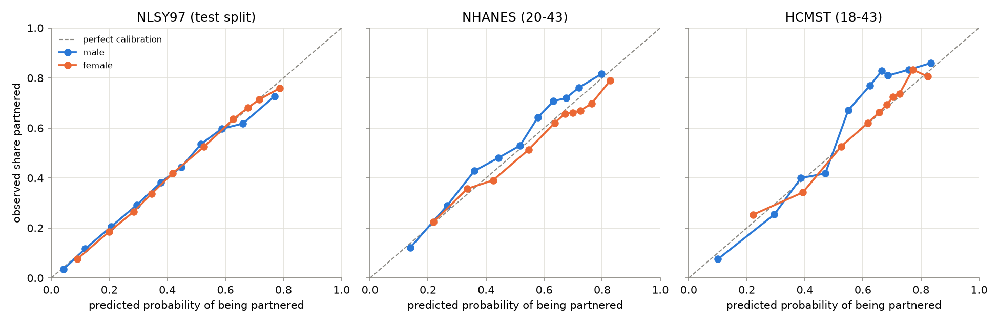
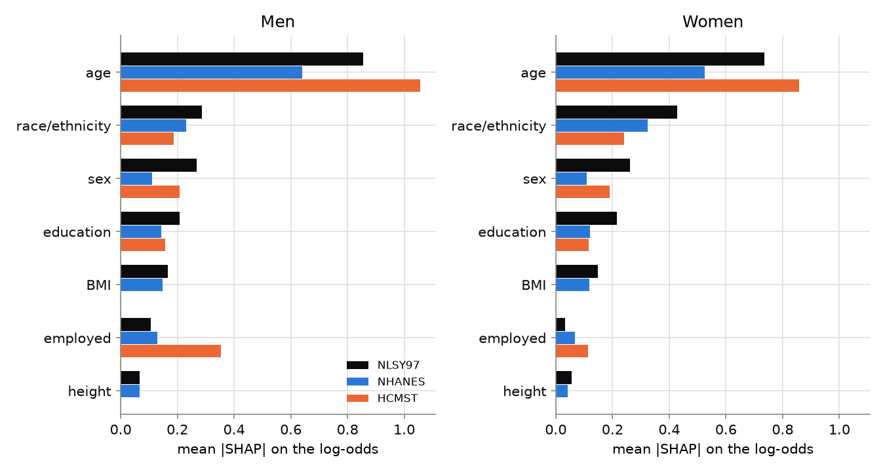

# Outside check: does the NLSY97 model hold in other surveys?

The main model was trained on one cohort (NLSY97, born 1980-84). This page asks whether
what it learned describes other Americans, measured by other surveys: **NHANES** (a
health examination survey, cycles 2007-2021) and **HCMST 2017** (Stanford's couple
survey). A finding that shows up in all three surveys is a fact about America, not an
accident of one sample; one that shows up once is suspect. This is *external validation*.

Three questions, matching the three sections: the NLSY97 recipe scored unchanged on the
other surveys; the same recipe retrained on each survey to compare what each feature
does there; and HCMST's count of "singles" who do have a partner, just not a live-in one.

## The three surveys, side by side

| survey | interviews | ages | rows scored | partnered | height / BMI | employed asks |
|---|---|---|---|---|---|---|
| NLSY97 | 1998-2024 | 18-43 | 26,434 | 0.428 | self-reported | worked any weeks last year |
| NHANES | 2007-2021 | 20-43 | 16,410 | 0.554 | measured at exam | working now |
| HCMST | 2017 | 18-43 | 1,416 | 0.606 | not asked | working for pay now |

The NLSY97 row is the held-out test split; rows are person-interviews, unweighted, ages
restricted to the main model's 18-43. Race/ethnicity is hispanic / black / other in all
three ("other" includes Asian and multiracial respondents; NHANES's 2007 cycles have no
Asian category).

## The core model, scored unchanged

The **core model** is train.py's CatBoost recipe (same preprocessing, same settings) on
only the seven columns all three surveys share: age, sex, race/ethnicity, education,
employed, height, BMI - plus a five-feature version of the same recipe without height
and BMI. Both are fitted on the NLSY97 **train split** and then applied unchanged - no
refitting, no recalibration, nothing fitted on the target survey - to NHANES and HCMST.

**Rows without measured height/BMI get the five-feature version of the same recipe**
(age, sex, race/ethnicity, education, employed), also fitted on the NLSY97 train split.
That is all of HCMST (the survey never asks height or weight) and
8% of NHANES 20-43s (interviewed but not examined); on the NLSY97
test split itself, only 0.2% of rows. The reason not to
just hand the missing columns to the seven-feature model: CatBoost's default missing-value
handling reads NaN as "shorter/lighter than anyone in training", a branch NLSY97 barely
exercised. Forcing height and BMI to missing on the NLSY97 test set alone - same people,
nothing else changed - drops the mean prediction from 0.435 to
0.294, a 14 pp
mechanical shift that would have masqueraded as a survey difference.

| survey | model | rows | partnered | mean pred. | log loss | brier | ROC-AUC | calib. error |
|---|---|---|---|---|---|---|---|---|
| NLSY97 (test split) | core model (trained on NLSY97) | 26,434 | 0.428 | 0.435 | 0.5667 | 0.1936 | 0.7662 | 0.0116 |
| NLSY97 (test split) | age + sex rates of this survey | 26,434 | 0.428 | 0.437 | 0.6007 | 0.2086 | 0.7178 | 0.0100 |
| NHANES (20-43) | core model (trained on NLSY97) | 16,410 | 0.554 | 0.550 | 0.6109 | 0.2113 | 0.7119 | 0.0197 |
| NHANES (20-43) | age + sex rates of this survey | 16,410 | 0.554 | 0.554 | 0.6304 | 0.2200 | 0.6768 | 0.0001 |
| HCMST (18-43) | core model (trained on NLSY97) | 1,416 | 0.606 | 0.576 | 0.5687 | 0.1916 | 0.7484 | 0.0484 |
| HCMST (18-43) | age + sex rates of this survey | 1,416 | 0.606 | 0.606 | 0.5553 | 0.1867 | 0.7579 | 0.0007 |

The comparison floor is each survey's **own age + sex rates** (fitted on that survey;
the NLSY97 floor is fitted on train and scored on the held-out test split, as in
evaluate.py - NHANES's and HCMST's floors are fitted on the rows they are scored on).
Mean pred. is the average prediction - how far off the *level* is.

What the table says:

- **NHANES: the model transfers.** Better log loss and better AUC than the local floor
  (an in-sample cell-rate floor is unbeatable on calibration error by construction), and
  the level is nearly right. Moving from the home test split to NHANES costs
  0.044 log loss and 0.054 AUC.
- **HCMST: the model nearly matches the local floor.** AUC reaches 0.748
  (men 0.800, women 0.712)
  with the mean prediction 3 pp below the
  60.6% observed - HCMST's own age + sex rates stay slightly ahead
  (0.555 vs 0.569 log loss,
  0.758 vs 0.748 AUC). The remaining gap is not a
  level shift across the board: it concentrates in men 30+ (see the figure below), whose
  partnered rate rises faster through the late 20s in HCMST than the mixed-decades
  gradient the core model learned - consistent with Americans partnering later, though
  the surveys also differ in sample and wording.
- For scale: the full-featured main model scores 0.5425 log loss / 0.7896 AUC on
  the same test split (`results/metrics.md`, read from that file); keeping only the seven
  shared columns costs 0.024 log loss and
  0.023 AUC.

The model line is its mean prediction at each age; dots are the observed share per age
band (bands, because HCMST has ~1,400 rows - per-age dots would be noise). NHANES's line
hugs the dots, reading only men 35-43 clearly low. HCMST's remaining gap concentrates in
men 30+, whom the model scores clearly below their observed share - HCMST's partnered
rate rises faster through the late 20s than the mixed-decades gradient the model
learned - while for women under 25 the model runs slightly high.

## The same recipe fitted on each survey

Each survey gets its own core model (same recipe, fitted on its own rows), explained by
SHAP on the rows it was fitted on. Size is the average strength of a feature's push
(mean |SHAP| on the log-odds) for men and women separately; direction is the value group
with the strongest down and up push, in percentage points around that survey's own
partnered rate. HCMST's height and BMI columns are empty, so there is nothing to read.

| feature | NLSY97 men | NLSY97 women | NHANES men | NHANES women | HCMST men | HCMST women |
|---|---|---|---|---|---|---|
| age | 0.85 | 0.74 | 0.64 | 0.53 | 1.06 | 0.86 |
| race/ethnicity | 0.29 | 0.43 | 0.23 | 0.32 | 0.19 | 0.24 |
| sex | 0.27 | 0.26 | 0.11 | 0.11 | 0.21 | 0.19 |
| education | 0.21 | 0.22 | 0.14 | 0.12 | 0.16 | 0.12 |
| BMI | 0.17 | 0.15 | 0.15 | 0.12 | — | — |
| employed | 0.11 | 0.03 | 0.13 | 0.07 | 0.35 | 0.11 |
| height | 0.07 | 0.06 | 0.07 | 0.04 | — | — |

| feature | NLSY97 | NHANES | HCMST |
|---|---|---|---|
| age | 18-24 -20.7 pp ... 35-43 +21.4 pp | 18-24 -29.8 pp ... 35-43 +12.8 pp | 18-24 -42.7 pp ... 35-43 +20.4 pp |
| race/ethnicity | black -14.9 pp ... other +6.8 pp | black -17.1 pp ... hispanic +5.5 pp | black -17.3 pp ... other +3.4 pp |
| sex | male -6.4 pp ... female +6.5 pp | male -1.2 pp ... female +0.6 pp | male -4.0 pp ... female +3.7 pp |
| education | some_college -5.5 pp ... less_than_hs +6.6 pp | some_college -3.5 pp ... less_than_hs +3.8 pp | some_college -3.6 pp ... less_than_hs +6.4 pp |
| BMI | low -4.9 pp ... high +3.9 pp | low -2.4 pp ... middle +2.4 pp | not measured in this survey |
| employed | not employed -5.0 pp ... employed +1.0 pp | not employed -0.8 pp ... employed +0.6 pp | not employed -11.7 pp ... employed +3.4 pp |
| height | low -0.7 pp ... high +1.6 pp | middle -0.2 pp ... low +0.4 pp | not measured in this survey |

Read together:

- **Age** is the strongest feature in every survey, for both sexes, by a wide margin -
  and its pull steepens from NLSY97 to HCMST (see the short version below).
- **Sex**: women are more likely to be partnered at the same age in all three surveys,
  though NHANES's gap is the smallest.
- **Race/ethnicity**: the Black partnered gap appears in all three surveys at nearly the
  same size, and is a bigger push for women than men everywhere. This is the most
  replicated single finding on this page.
- **Education**: all three surveys put "some college, no degree" at the bottom and both
  education extremes higher - a U-shape, not a ladder.
- **Employed** pushes up everywhere and matters more for men than women in all three.
  Its size varies widely across surveys - far more than the wording of the question
  explains, since NHANES and HCMST ask near-identical "working now" questions and sit
  10x apart.
- **Height** is the smallest measured feature in both surveys that have it; **BMI**
  shows one consistent move - the lightest tertile down - and little else.

## HCMST: "single" is not "no partner"

The main model's target counts marriage and living together, so a girlfriend or
boyfriend not living with you counts as single. HCMST is the one survey that asks. Among
its 18-43s with no live-in partner:

| age | men | men with a partner | women | women with a partner |
|---|---|---|---|---|
| 18-24 | 94 | 29% | 104 | 58% |
| 25-29 | 93 | 28% | 92 | 59% |
| 30-34 | 26 | 42% | 38 | 63% |
| 35-43 | 56 | 41% | 55 | 62% |
| all 18-43 | 269 | 32% | 289 | 60% |

46% of them have a partner
they don't live with - 60%
of the women but only 32%
of the men, a gap that holds in every age band. So the main model's "single" class is a
mix - mostly unpartnered men and women who do have a partner - and anything the model
says about "singles" is about *not cohabiting*, not about being alone. A feature that
helps people date without moving in (many, plausibly) will look weaker for this target
than it is for "has a relationship at all".

## The short version

- **The recipe travels to NHANES.** Scored unchanged, the NLSY97 core model beats NHANES's own age + sex rates on loss and ranking: 0.611 vs 0.630 log loss, 0.712 vs 0.677 AUC (an in-sample cell-rate floor is unbeatable on calibration error by construction). Even its level is nearly right (mean prediction 0.550 against 0.554 observed).
- **HCMST: once missing height/BMI are handled, the recipe nearly holds its own.** The same scoring reaches 0.748 AUC with a mean prediction of 0.576 against 0.606 observed - a 3 pp shortfall, concentrated in men 30+. HCMST's own age + sex rates stay slightly ahead (0.555 vs 0.569 log loss, 0.758 vs 0.748 AUC), on a survey whose age gradient is steeper than the mixed decades the model learned from.
- **Age dominates in all three surveys** (largest mean |SHAP| for both sexes everywhere), and the young-adult gap grows from NLSY97 to NHANES to HCMST: 18-24 sits 21 / 30 / 43 pp below its survey's average - consistent with younger generations partnering later, though age and interview year are the same variable inside NLSY97, so samples and wording also play in.
- **The Black partnered gap replicates at full size**: -14.9 / -17.1 / -17.3 pp below the survey average in NLSY97 / NHANES / HCMST, and the push is bigger for women than men in all three (e.g. NLSY97: 0.43 vs 0.29 mean |SHAP|).
- **"Some college, no degree" partners latest in all three surveys** (-5.5 / -3.5 / -3.6 pp), while the ends of the education range partner sooner (less than high school +6.6 / +3.8 / +6.4 pp). The shape is a U, not a ladder: it is not "more education, more partnering".
- **Employment pushes up everywhere and matters more for men** (mean |SHAP|, men vs women: NLSY97 0.11/0.03, NHANES 0.13/0.07, HCMST 0.35/0.11), but its size varies widely across surveys - the not-employed-vs-employed gap is 6 pp in NLSY97, 1 pp in NHANES and 15 pp in HCMST - and the question wording does not explain it: NHANES and HCMST ask near-identical "working now" questions, yet sit 10x apart.
- **Height barely registers wherever it is measured** (mean |SHAP| at most 0.07, largest low-to-high gap 2.3 pp) - the "short men partner less" story does not show up in who ends up partnered. BMI: the lightest tertile sits -4.9 pp (NLSY97) and -2.4 pp (NHANES) below average; above that, little.
- **"Single" means "no live-in partner" - and many singles are not partnerless.** In HCMST, 46% of the 18-43s the main model would call single have a girlfriend or boyfriend they don't live with: women 60%, men 32%. The main model's target cannot see relationships short of cohabitation, and the men it calls single are far more often truly alone than the women.

## Why the surveys can disagree

- **Definitions**: "employed" means the past year in NLSY97 and the interview week in
  NHANES/HCMST; NHANES measures height and weight, NLSY97 asks (people overstate height
  and understate weight); "married, spouse absent" still counts as partnered everywhere.
- **Years**: NLSY97's rows span interviews 1998-2024, NHANES 2007-2021, HCMST 2017.
  Age and interview year are the same variable inside NLSY97 (its 18-24 rows are all
  from 1998-2009, its 35-43 rows only from 2014-2024), so no within-survey check can
  separate "younger generations partner later" from sample and wording differences.
- **Samples**: NLSY97 oversamples Black and Hispanic youth and follows one birth cohort;
  NHANES is a health survey whose examination subsample lacks height/BMI for ~8%
  (scored here with the five-feature model); HCMST is an online probability panel whose
  own published married rate runs above Census (a married-against-partnered comparison),
  and its LGB oversample is only down-weighted by weights this page does not use.
- **Target transport**: each survey decides partnered status with its own questions;
  NLSY97's is closest to "who lives with a partner on the interview date", HCMST's to a
  partnership screener. Small differences in wording move the level by points.

## Limits

Associations, not causes, throughout. Unweighted numbers (the surveys' sampling weights
are unused, as everywhere else in this project). The per-survey models are fitted and
explained on the same rows - their pushes describe what the recipe learned there, not an
out-of-sample score. HCMST is small (1,416 rows, ~650 per sex), so its per-sex
numbers wobble. NHANES cycles are pooled as if one survey. And the core model's seven
features leave out most of what matters (earnings, family background, personality), so
"what held" here is about these seven, not about the full model.
